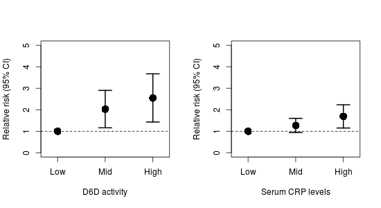

## Background: ##

Greater systemic inflammation can disrupt metabolic processes
throughout the body.  Greater inflammation has also been implicated in
the development of plaque buildup in blood vessels, potentially
leading to cardiovascular disease (CVD).  The most common type of CVD
is coronary artery disease (CAD), which can increase the risk for
heart attacks --- also known as myocardial infarctions (MI)

The n-3 long chain polyunsaturated fatty acids (n-3 LC-PUFA)
eicosapentaenoic acid (EPA) and docosahexaenoic acid (DHA) are
precursors to potent anti-inflammatory molecules.  While EPA and DHA
can be obtained from the diet, we can also synthesize them from the FA
alpha-linolenic acid (ALA).  The n-6 LC-PUFA equivalent of the n-3
LC-PUFA is arachidonic acid (ARA), which can be used in signaling
pro-inflammatory processes.  As with the n-3 LC-PUFA, ARA can be
obtained from the diet as well as synthesized from linoleic acid (LA).
However, both ALA and LA are essential FA and can *only* be obtained
from the diet.  ALA and LA are converted into their longer chain
equivalents (EPA+DHA and ARA, respectively) by the same delta-6
desaturase (D6D) enzyme and therefore compete for its activity.

## Study 1 (Value 10/50): ##

To observe the role of fatty acids on the risk for CAD, a large
prospective longitudinal cohort was initiated many years ago in order
to record cardiovascular events.  Participants were recruited from
several cities in Canada.  At the baseline visit, participants had
their body mass determined and had blood samples taken.  Blood samples
were analyzed for C-reactive protein (CRP), which is a marker of
systemic inflammation, and were also analyzed for serum FA and D6D
activity.  Every year, participants were called to record any
cardiovascular events that had occurred over the previous year.

After 15 years, the data collected were analyzed.  Relative risks (RR)
were calculated on tertiles of CRP and D6D activity with CAD events.
RR indicate the percent in risk that greater CRP or D6D have on CAD
events.  A RR is *not* significant if the range crosses the 1.0 value
(for example, a RR of 1.30 with a confidence interval of 0.90 to 1.50
is considered not significant).

\newpage\newpage

|                        | CAD-free (n=621) | CAD (n=457) | p-value |
|------------------------+------------------+-------------+---------|
| BMI                    | 25.5             | 26.3        |    0.11 |
| Serum LA (g/100g)      | 9.77 (1.38)      | 9.05 (1.40) |  <0.001 |
| Serum ARA (g/100g)     | 19.1 (1.45)      | 23.2 (1.75) |  <0.001 |
| Serum ALA (g/100g)     | 0.10 (0.03)      | 0.09 (0.04) |    0.24 |
| Serum EPA+DHA (g/100g) | 6.84 (1.47)      | 7.03 (1.56) |    0.34 |

Table: **Baseline** characteristics of participants who either
developed CAD or did not develop CAD (CAD-free) within a 15 year
timeframe.

_Values are the means and standard deviations._

### Questions: ###

1. Describe the results in Table 1 and Figure 1. (Value 4/50)

2. Drawing on information from the Background and the data in Table 1
   and Figure 1, discuss a potential mechanism for how dietary PUFA
   may influence the risk for developing CAD. (Value 6/50)

## Study 2 (Value 40/50): ##

There is some public health concern that the ratio of dietary n-6 to
n-3 FA is important for cardiovascular health, particularly in regard
to Western style diets.  It is generally argued that the North
American diet is too high in n-6 relative to n-3 FA.  Therefore, a
community intervention was conducted over one year in the US to
determine the effectiveness of strategies that aim to reduce dietary
n-6 PUFA (indicated as the "Low" group).  A nearby community with
similar characteristics as the intervention community was used as the
control group (indicated as the "High" group).  Body mass index,
dietary intake, and blood samples were collected from each
participant.  Blood samples were used to measure CRP and serum FA.

The field of nutrigenomics has revealed several candidate genes that
may influence FA metabolism.  These group of alleles, called the
*FADS* gene cluster, have been associated with modulation in D6D
activity.  Therefore, a cheek swab was taken to extract DNA to
quantify the gene cluster in the participants, who were then
classified as "Low" if they had <4 *FADS* alleles present and "High"
if they had >4 *FADS* alleles present.

There were no significant differences in BMI and dietary intake of n-3
FA between the two groups.  However, dietary n-6 did decrease in the
intervention group, suggesting good participation in the intervention.

|                         | Low FADS alleles | High FADS alleles |
|-------------------------+------------------+-------------------|
| Serum LA (g/100 g)      | 12.2 (1.54)      | 9.96 (1.10)*      |
| Serum ARA (g/100 g)     | 18.54 (2.08)     | 20.19 (1.98)*     |
| Serum ALA (g/100 g)     | 0.11 (0.02)      | 0.09 (0.01)*      |
| Serum EPA+DHA (g/100 g) | 7.33 (1.45)      | 7.78 (1.23)*      |

Table: Differences between a low number of FADS alleles and a high
number of FADS alleles before the intervention.

_\* indicates significantly different (p<0.05) from participants with
"Low" FADS alleles._

### Questions: ###

3. Describe the results of Table 2. (Value 2/50)

4. Using the Background information and the data from Table 2, discuss
   how the *FADS* gene cluster is influencing D6D activity.  Assume
   that dietary intake of n-6 and n-3 FA did not differ between groups
   at the baseline measurements. (Value 5/50)

5. Describe the results of Figure 2. (Value 2/50)

6. Using **all** information and data up to this point, discuss how
   the *FADS* gene cluster may influence the risk for CAD. (Value 6/50)

7. Imagine you are clinician and a patient comes in who has has a
   mixed, but predominately African ancestry.  Considering that
   individuals with African ancestry are more likely to have more
   alleles of the *FADS* gene cluster, using the information and data
   in this exam and your previous knowledge, how could you reduce
   his/her risk for CAD disease? Defend your answer by incorporating
   data from both studies. (Value 7/50)

8. Given that all of these studies were conducted in Western countries
   with a high n-6 to n-3 ratios, discuss how the association between
   higher D6D activity and CAD risk may differ in countries with a
   lower dietary n-6 to n-3 ratio (for example, in Inuits consuming a
   traditional diet).  Explain any neutral or positive influences the
   *FADS* alleles may have.  Defend your answer using your own
   knowledge, the Background information and the two studies. (Value
   8/50)

9. A recent large randomized, controlled clinical trial showed no
   effect of n-3 LC-PUFA supplementation on myocardial infarction (a
   common outcome of CAD).  Comment on 1) why a clinical trial may not
   always be able to identify effects with supplementation in the
   general population and 2) why targeting only n-3 LC-PUFA may not
   always be effective.  Use your previous knowledge and all the
   information and data from this exam. (Value 10/50)

