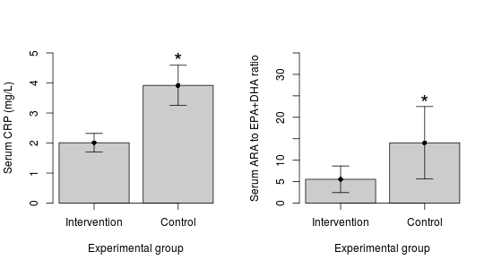
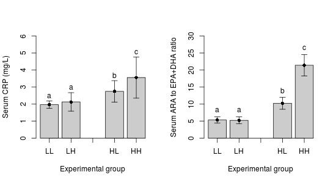

# (Very) rough draft of final #

## Background: ##

Greater systemic inflammation can disrupt multiple organs including
the adipocytes, potentially leading to an increased release of stored
free fatty acids (FA), as well as discruption lipid and cholesterol
metabolism.  Lipids and cholesterol are packaged in the liver into
very-low density lipoproteins (VLDL) and low density lipoproteins
(LDL).  Higher levels of circulating LDL may eventually penetrate the
blood vessels, building up plaque and leading to cardiovascular
disease (CVD).  The most common type of CVD is coronary artery disease
(CAD), which can increase the risk for heart attacks --- also known as
myocardial infarctions (MI)

The n-3 long chain polyunsaturated fatty acids (n-3 LC-PUFA)
eicosapentaenoic acid (EPA) and docosahexaenoic acid (DHA) are
precursors to potent anti-inflammatory molecules.  While EPA and DHA
can be obtained from the diet, we can also synthesize them from the FA
alpha-linolenic acid (ALA).  The n-6 LC-PUFA equivalent of the n-3
LC-PUFA is arachidonic acid (ARA) and is the precursor to potent
pro-inflammatory molecules.  As with the n-3 LC-PUFA, ARA can be
obtained from the diet as well as synthesized from linoleic acid (LA).
Both ALA and LA are essential FA and can *only* be obtained from the
diet.  ALA and LA are converted into their longer chain equivalents by
the same delta-6 desaturase (D6D) enzyme and so compete for its
action.

## Study 1: ##

Prospective longitudinal cohort.  Cross-sectional at the baseline
visit on inflammation (CRP), serum and dietary levels of the LC-PUFA.
Prospective data on CAD events.

The RR... (if it ranges between less than 1.0 and greater than 1.0
there is no significant difference; for example, a CI of 0.98 to 1.15
is not significant).

(Still need to develop this more. Tables and figures will to created
after discussing with Carol)

|                               | CAD-free (n=621) | CAD (n=457) | p-value |
|-------------------------------+------------------+-------------+---------|
| BMI                           | 25.5             | 26.3        |    0.11 |
| Serum LA (g/100g)             | 9.77 (1.38)      | 9.05 (1.40) |  <0.001 |
| Serum ALA (g/100g)            | 0.10 (0.03)      | 0.09 (0.04) |    0.24 |
| AA/LA (ratio)                 | 1.99 (0.36)      | 2.17 (0.41) |  <0.001 |
| DHA+EPA/ALA (ratio)           | 7.12 (2.91)      | 8.09 (3.83) |   0.009 |

Table: Baseline characteristics of participants who either developed
CAD or did not develop CAD (CAD-free) within a 15 year timeframe.
Values are the means and standard deviations.

### What we want them to get at: ###

We want them to highlight that:

* Inflammation contributes to CAD
* ?? Higher intake of n-6 may be bad
* Greater ARA relative to EPA+DHA is bad
* Greater D6D is bad
* That paradoxically LA is lower, while ALA is the same, in those who
  will develop CAD
* And that paradoxically DHA+EPA is also higher, but ARA is higher
* ?? Higher intakes of n-6 appear bad, but no influence of n-3

## Study 2: ##

A community intervention was conducted to determine the effectiveness
of strategies that aim to reduce dietary n-6 PUFA.

A group of alleles that influence fatty acid desaturate activity
(*FADS* gene) has been speculated to influence the risk for CAD.  A
greater number of *FADS* alleles is associated with greater D6D
activity and the resulting increased conversion of ALA and LA to their
respective longer chain counterparts (EPA+DHA and ARA, respectively).
Therefore, the number of *FADS* alleles were measured in all
individuals in each community.

(Include this?: Dietary intake of LA and ALA is thought to be best
around a 1-to-1 ratio.  The current Western diet is approximately
20-30-to-1 ratio (greater levels of LA).)

* LL = low n-6 (intervention) and <4 FADS alleles (low activity)
* LH = low n-6 (intervention) and >4 FADS alleles (high activity)
* HL = high n-6 (control) and <4 FADS alleles (low activity)
* HH = high n-6 (control) and >4 FADS alleles (high activity)

* Showing that the non-intervention group has a higher level of n-6
  intake

|             | Intervention | Control |
|-------------+--------------+---------|
| BMI         | NS           | NS      |
| Dietary n-3 | NS           | NS      |
| Dietary n-6 | -150%        | NS      |

Table: Significant percent changes in basic characteristics of
participants from the two groups before and after the
intervention. NS = not significantly different.

|                         | Low FADS alleles | High FADS alleles |
|-------------------------+------------------+-------------------|
| Serum LA (g/100 g)      | 12.2 (1.54)      | 9.96 (1.10)*      |
| Serum ARA (g/100 g)     | 18.54 (2.08)     | 20.19 (1.98)*     |
| Serum ALA (g/100 g)     | 0.11 (0.02)      | 0.09 (0.01)*      |
| Serum EPA+DHA (g/100 g) | 7.33 (1.45)      | 7.78 (1.23)*      |

Table:  Differences between a low number of FADS alleles and a high
number of FADS alleles before the intervention.

### What we want them to get at: ###

We want them to highlight that:

* More FADS alleles greater ARA and EPA+DHA
* More FADS greater CRP
* More FADS + greater intake of n-6 = inc CRP, ARA, and TAG
* Lower intake of n-6 reduces CRP, ARA, and TAG
* While paradoxical, the higher EPA+DHA in the FADS group is not
  enough to offset the higher levels of LA.
* Greater LA competes for the D6D enzyme and too much LA reduces
  production of EPA+DHA, favouring ARA.

## Possible questions: ##

Based on the data from Study 2, comment on why more individuals with
African ancestry had more CAD events.

Discuss why TAG might be higher in the high FADS + high n-6 intake
group.  Use the Background, Study 1, and Study 2 to defend your
answer.

Discuss the potential mechanisms underlying Study 2

Given the role that inflammation (CRP) and elevated serum lipids (TAG)
play in CAD, comment on the risk for CAD that the intervention
community may have compared to the non-intervention community.  What
are some factors that may influence the results of Study 2, given that
it is a community intervention?

Imagine you are clinician and a patient comes in who has has a mixed,
but predominately East African ancestry.  Given that individuals with
African ancestry are more likely to have more alleles of the FADS gene
cluster, given the data and your past knowledge, how could you reduce
their risk for CAD disease? Defend your answer using *only* the data
from both studies.

Final question (?)

Using your previous knowledge and all the data from this final: A
recent clinical trial showed no effect of n-3 LC-PUFA on myocardial
infarction (a common outcome of CAD), comment on 1) some reasons why
improvements in dietary lipids may not translate to reductions in
heart attack, 2) why a clinical trial may not always be able to
pick up causal mechanisms in the general population, even though a
causal effect may actually be present in a subset of the population
(for example, FADS polymorphisms), and 3) why targeting only n-3
LC-PUFA may not always be effective.

# Ideas/notes for the final #

Maybe instead of African + SFA intake with CVD, we look at how the
role of SFA vs carbs on lipoprotein size and atherogenicity?

BUT: There is the *FADS* gene which about 80% of African Americans
carry two copies of the gene (associated with increased levels of
arachidonic acid) compared to about 45% in European Americans.

*FADS* gene and LDL

ALA -> d5d (FADS1) and d6d (FADS2) -> DHA
LA -> d5d and d6d -> AA

Greater d5d and d6d toward AA increase risk for CAD

Combination of **both** FADS gene + dietary intake is important

rs174548 in FADS1 may influence cholesterol metabolism

Individuals with CAD had lower levels of LA than controls.  So even
though it has a greater inflammatory properties, it is still
essential (for arterial stiffness).  Combined with higher d6d + d5d activity.

Combination of higher LA intake, lower ALA intake, and greater d6d
activity (eg. more risk alleles on the FADS gene cluster) is the worst
case.

Even though greater d9d and elongase contribute to more ARA *and*
EPA+DHA, there are vastly greater levels of both LA in the diet + more
ARA. So the protective effect of EPA+DHA is offset by the higher
levels of LA+ARA. (Martinelli)

Good figures/tables in Martinelli2008
